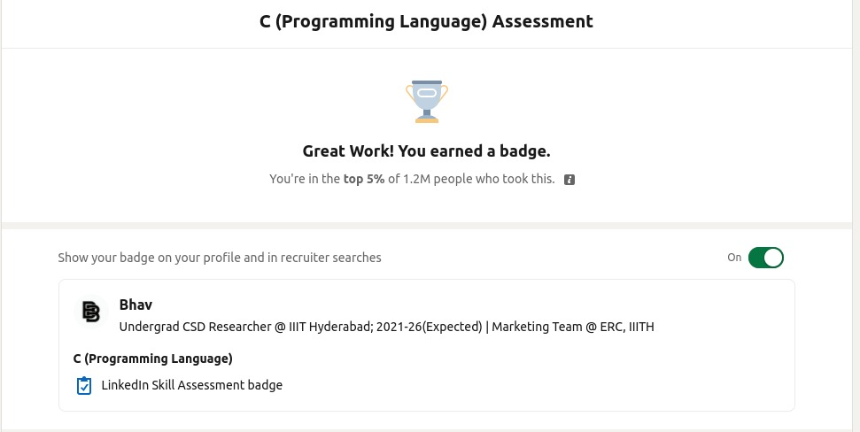

##  Hi, I’m <ins>***BHAV BERI***</ins>. 
----

- 👀 I’m interested in Learning New Things, Mainly in field of Computer Science & Applications. I am a creatively curious learner.
- 🌱 I’m currently in **Computer Science Dual Degree** (B.Tech. + M.S. by Research) *@IIIT, Hyderabad*
- 💞️ I’m looking to collaborate on many things & learn new skills along with helping others with what I currently know.
- 📫 How to reach me ... 
  - 
  - 
- Some of my other ~~almost empty~~ profiles
  - 
  - 
  - 

  

<!--p align="left">  </p-->

----

<!--div align=center>
    
</div-->

----
#### My Second Github Profile : _[@ b-beri](https://github.com/b-beri)_

<!--div align=center>
    
</div-->

----
----

### <ins>Some of my Current Badges</ins> :-
- [Certified in Problem Solving(Basic) on Hackerrank](https://www.hackerrank.com/certificates/008157a83c75)
- [Certified in Python(Basic) on Hackerrank](https://www.hackerrank.com/certificates/ed93b82d87fc)
- [Certified in SQL(Basic) on Hackerrank](https://www.hackerrank.com/certificates/991888df6807)
 

- My Gold Badges on <a href="https://www.hackerrank.com/bhavberi">Hackerrank</a> (Python, C, Problem Solving, SQL):-   
  
   
  
  
   
 

- _[Linkedin Verified C Language Skill Badge](https://www.linkedin.com/posts/bhavberi_linkedinskillassessment-clanguage-programming-ugcPost-6897432135054061568-MX3z)_ (Passed Skill Assignment with being _**Top 5%**_ of _1.2M_ people who took the test by that time)

- _[POSTMAN STUDENT EXPERT](https://www.linkedin.com/posts/bhavberi_postman-studentexpert-activity-6911988451550584832-9dFr?utm_source=linkedin_share&utm_medium=member_desktop_web)_ 

----

<!---
bhavberi/bhavberi is a ✨ special ✨ repository because its `README.md` (this file) appears on your GitHub profile.
You can click the Preview link to take a look at your changes.
--->
