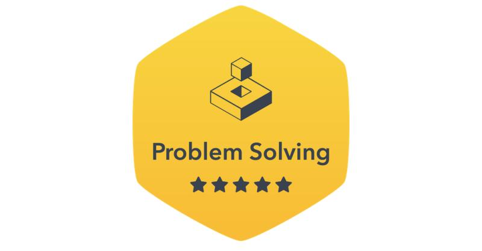

- 👋 Hi, I’m Bhav Beri.  @bhavberi
- 👀 I’m interested in Learning New Things, & Mainly Computer Science & Applications.
- 🌱 I’m currently learning CSD
- 💞️ I’m looking to collaborate on many things.
- 📫 How to reach me ... 
  - [bhavberi.github.io](bhavberi.github.io)
  - bhavberi@gmail.com *But Mention Your Name and Subject Correctly*

<a href="https://www.hackerrank.com/bhavberi?badge=python&stars=5&level=3&hr_r=1&utm_campaign=social-buttons&utm_medium=linkedin&utm_source=badge_share_profile&social=linkedin">
  My Python Gold Badge on Hackerrank
  
</a> 
<a href="https://www.hackerrank.com/bhavberi?hr_r=1&badge=c&stars=4&level=2&social=linkedin">
  My C Silver Badge on Hackerrank
  
</a> 
<a href="https://www.hackerrank.com/bhavberi?badge=problem-solving&stars=5&level=3&hr_r=1&utm_campaign=social-buttons&utm_medium=linkedin&utm_source=badge_share_profile&social=linkedin">
  My Problem Solving Gold Badge on Hackerrank
  
</a> 

- [Certified in Problem Solving(Basic) on Hackerrank](https://www.hackerrank.com/certificates/008157a83c75)

- [Certified in Python(Basic) on Hackerrank](https://www.hackerrank.com/certificates/ed93b82d87fc)

My Hackerrank Profile : https://www.hackerrank.com/bhavberi

My CodeChef Profile : https://www.codechef.com/users/bhavberi

My CodeForces Profile : https://codeforces.com/profile/bhavberi  (Still Empty)

----
#### My Second Github Profile : _[@ b-beri](https://github.com/b-beri)_

<!---
bhavberi/bhavberi is a ✨ special ✨ repository because its `README.md` (this file) appears on your GitHub profile.
You can click the Preview link to take a look at your changes.
--->
